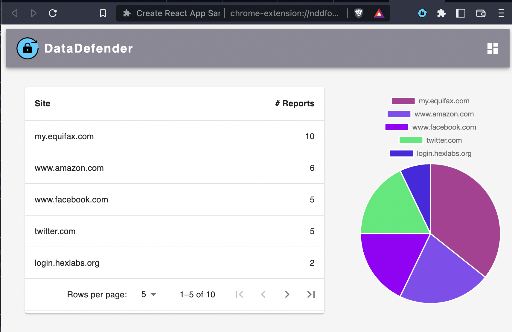
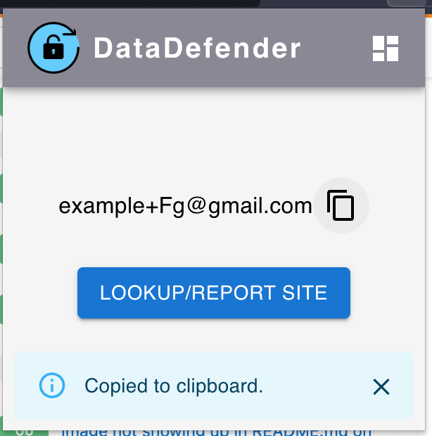
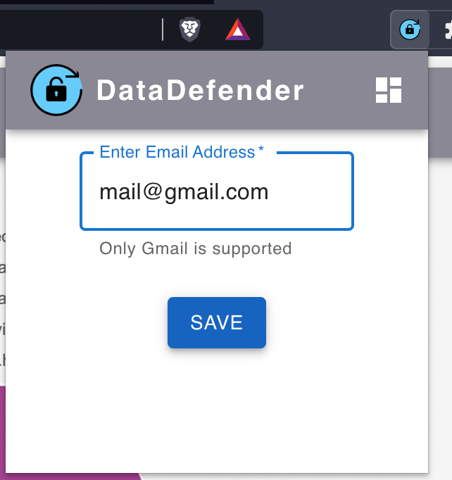
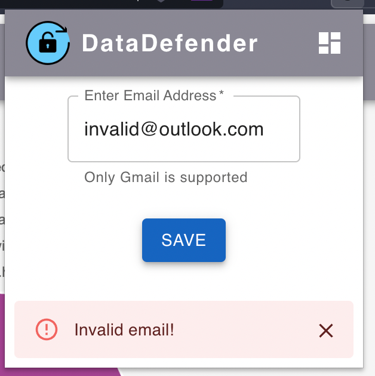
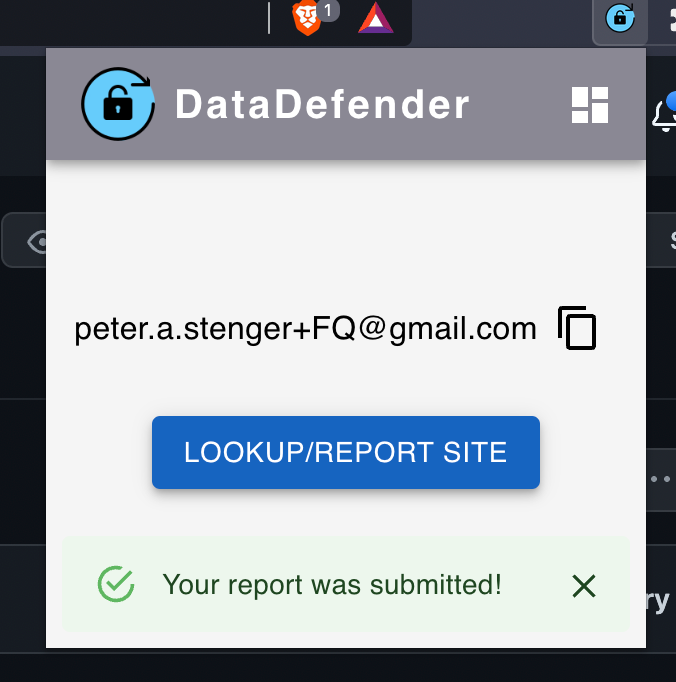
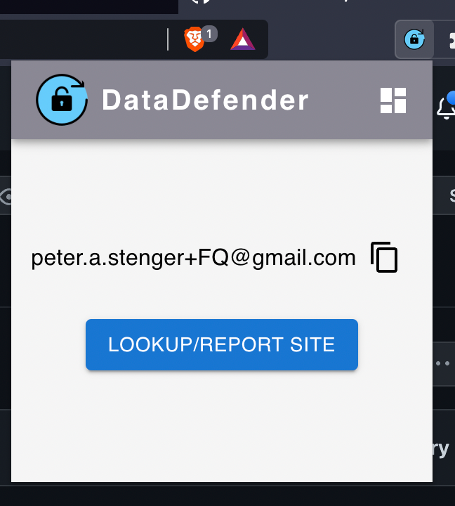
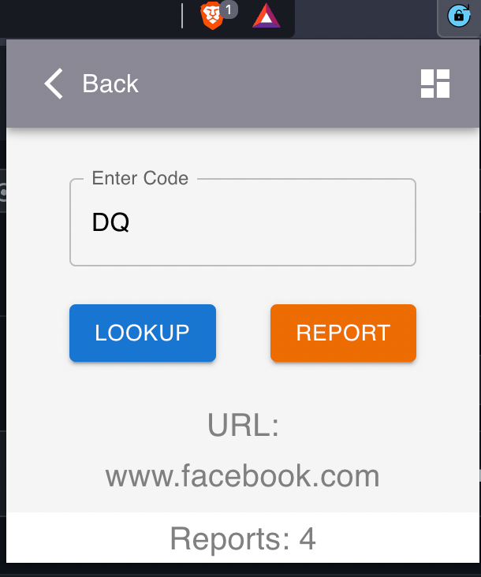

# DataDefenders

A chrome extension to let a user know which platforms are selling their personal information that leads to downstream utilization by marketers.
## Demoing the site

1. Go to `chrome://extensions`
2. In the top right, toggle "Developer Mode" on
3. Clone our repo (`git clone https://github.com/jtn26/DataDefenders`)
4. Go back to `chrome://extensions` and click "Load Unpacked"
5. Select the `frontend/build` directory and hit load

## Devpost

https://devpost.com/software/datadefender

## Presentation

`HackGT 9 Presentation.pdf`

## Screenshots

### Dashboard

### Copying Field

### Inputting Email

### Submitting Reports

